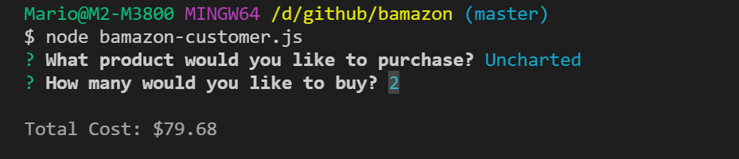
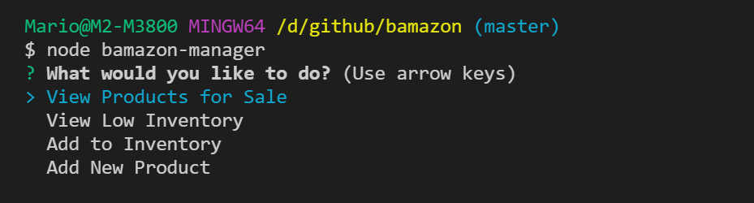
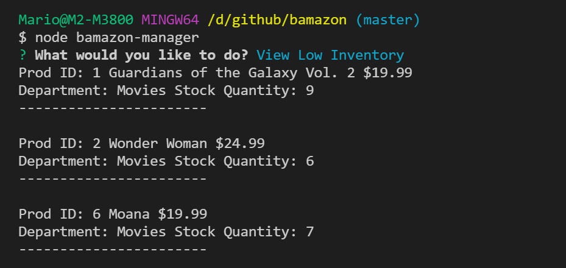
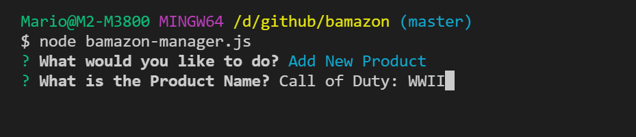
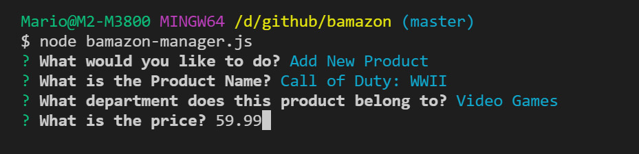
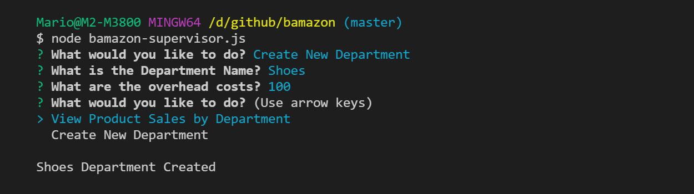

# bamazon

## Running the App

You can run this app by using any of the following commands. Each command has a different set of task for the user.

```
node bamazon-customer.js
```

```
node bamazon-manager.js
```

```
node bamazon-supervisor.js
```

### Bamazon Customer

Running `node bamazon-customer.js` will display a list of products for purchase allow you to select a product It will then prompt you for a quantity and display the Total Cost of your purchase.




### Bamazon Manager

Running `node bamazon-manager.js` will display 4 options View Products for Sale, View Low Inventory, Add to Inventory, and Add New Product



### View Products for Sale

It will display a list of all products for sale with the Product ID, Product Title, Product Price, Product Department, and Product Quantity


### View Low Inventory

It will display a list of all products that have an inventory of less than 10



### Add to Inventory

It will display a list of all products and allow you to select a product. Once a product is selected it will prompt you to add a number of units to add and then display how much inventory this product now has


### Add Product

This will prompt you to Add a product. It will ask you for a product name prompt you for what category it belongs to what the price is and how many are in stock at the end it will confirm that the product has been added.








## Bamazon Supervisor

Running `node bamazon-supervisor.js` will display 2 options View Product Sales by Department, and Create New Department


### View Product Sales by Department

This will display a table that shows Product Sales by Department


### Create New Department

This will allow you to create a New Department it will prompt you for a Department Name and Overhead Costs it will then confirm if the Department was created.


